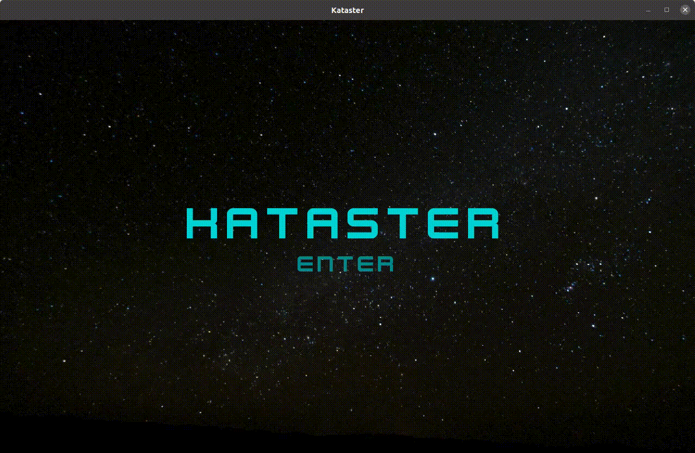

# Kataster
A minimalist single screen space shooter developped in the Rust language with the Bevy game engine.

This is a 'super-example' or 'micro-game' for the Bevy game engine, that can be used by beginners to get some starting points for their own game.

It includes use of game states, menu UI , HUD UI, collision detection, pause/resume, shader background, particle effects.

It showcases some other commonplace bevy plugins, _avian2d_ for physics, _leafwing-input-manager_ for game inputs, _bevy_hanabi_ for particle effects. 

## Bevy dependencies

Up to date for bevy 0.14